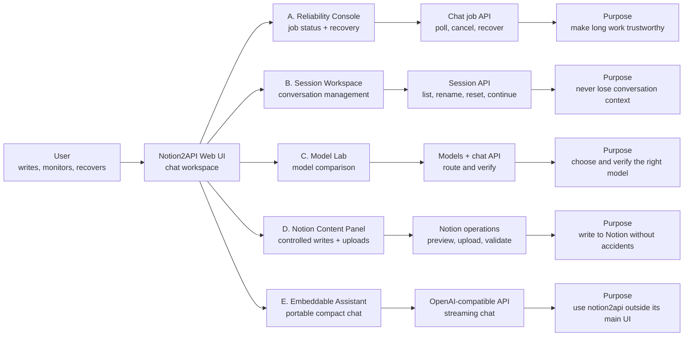
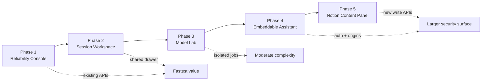

# Notion2API Widget Concepts

This map shows what each proposed creation looks like, what it connects to, and the user problem it solves.

## Product map



## Recommended combined desktop layout

```text
┌─────────────────────────────────────────────────────────────────────────────┐
│ Notion2API                 Model: Terra ✓             Jobs (2)   Settings   │
├────────────────┬──────────────────────────────────────┬─────────────────────┤
│ SESSION        │ CHAT WORKSPACE                       │ OPERATIONS DRAWER   │
│ WORKSPACE      │                                      │                     │
│                │ User prompt                          │ ● Running  01:42    │
│ Search...      │ ┌──────────────────────────────────┐ │ Research statutes   │
│                │ │ Compare the current statutes... │ │ 14 activity events  │
│ Recent         │ └──────────────────────────────────┘ │ [Cancel] [Details]  │
│ • Legal brief  │                                      │                     │
│ • Project plan │ Assistant response streams here...  │ ○ Completed  00:38  │
│ • Meeting prep │                                      │ Meeting summary     │
│                │                                      │ [Open response]     │
│ [New session]  │                                      │                     │
│ [Rename]       │                                      │ ⚠ Stalled  04:16    │
│ [Reset]        │                                      │ [Recover] [Cancel]  │
├────────────────┴──────────────────────────────────────┴─────────────────────┤
│ Attach   [ message input....................................... ]   Send    │
└─────────────────────────────────────────────────────────────────────────────┘
```

The Reliability Console and Session Workspace share one operations drawer. This is the recommended first release because both reuse existing notion2api APIs and solve the most common failure: a request continues working after the client loses track of it.

## A. Reliability Console

```text
┌─ Activity ──────────────────────────┐
│ ● Running                    01:42  │
│ Research statutes                   │
│ Model: Terra                        │
│ Session: legal-brief                │
│ Activity: 14 events                 │
│                                     │
│ [Cancel job]       [View details]   │
├─────────────────────────────────────┤
│ ⚠ Stalled                    04:16  │
│ [Recover response] [Cancel]         │
└─────────────────────────────────────┘
```

Purpose: show whether work is progressing, recover results after timeouts, and stop obsolete jobs without sending the prompt twice.

Primary states: queued, running, stalled, completed, failed, and cancelled.

## B. Session Workspace

```text
┌─ Conversations ─────────────────────┐
│ Search sessions...                  │
├─────────────────────────────────────┤
│ Legal brief            Active job ● │
│ Project plan           2 hours ago  │
│ Meeting prep           Yesterday    │
├─────────────────────────────────────┤
│ Selected: Legal brief               │
│ Local conversation: bound ✓         │
│ Notion thread: connected ✓          │
│ [Continue] [Rename] [Reset]         │
└─────────────────────────────────────┘
```

Purpose: make durable conversation identity visible so users can return to a thread, continue it safely, or recover its last answer.

## C. Model Lab

```text
┌─ Compare models ───────────────────────────────────────────────┐
│ Prompt: [ Summarize this research and identify conflicts... ] │
│                                                               │
│ Model A: Terra                   Model B: Claude               │
│ ┌───────────────────────────┐   ┌───────────────────────────┐ │
│ │ Response A streams here   │   │ Response B streams here   │ │
│ │ Requested: Terra          │   │ Requested: Claude         │ │
│ │ Actual: Terra ✓           │   │ Actual: Claude ✓          │ │
│ │ Finished: 38s             │   │ Finished: 44s             │ │
│ └───────────────────────────┘   └───────────────────────────┘ │
│                    [Export comparison]                        │
└───────────────────────────────────────────────────────────────┘
```

Purpose: compare answer quality and latency while proving which underlying model actually handled each request.

Constraint: each side must use an isolated request ID so polling and cancellation cannot affect the other run.

## D. Notion Content Panel

```text
┌─ Send to Notion ───────────────────────────┐
│ Target page: [ Search or paste page ID  ]  │
│ Action:      (•) Append  ( ) Replace       │
│ File:        [ Drop file or browse      ]  │
│                                             │
│ Preview                                     │
│ ┌─────────────────────────────────────────┐ │
│ │ Executive summary                      │ │
│ │ • Decision one                         │ │
│ │ • Follow-up owner                      │ │
│ └─────────────────────────────────────────┘ │
│ Existing content will be preserved.         │
│                      [Cancel] [Confirm sync] │
└─────────────────────────────────────────────┘
```

Purpose: make Notion writes deliberate and reviewable, preventing accidental overwrites and duplicate pages.

Constraint: file upload exists today, but broader page/database synchronization needs additional backend operations.

## E. Embeddable Assistant

```text
Website or Notion embed

                                      ┌─ Research Assistant ─────┐
                                      │ How can I help?          │
                                      │                          │
                                      │ You: Summarize this page │
                                      │ AI: Working...           │
                                      │                          │
                                      │ [Attach] [Message...] ➤  │
                                      └──────────────────────────┘
                                                   ▲
                                            floating launcher
```

Purpose: provide a small notion2api chat experience on another website or an externally embedded Notion page.

Constraint: use an iframe first. It provides the simplest security boundary for authentication, origins, styles, and updates.

## Delivery map



## Approval recommendation

Approve **Phase 1 + Phase 2** as one release: an Operations Drawer containing job reliability and session management. It solves a real current need, fits the existing interface, and avoids speculative backend expansion.

Defer Model Lab until the operations drawer proves stable. Defer the embed and content panel until their security and write requirements are explicitly chosen.
